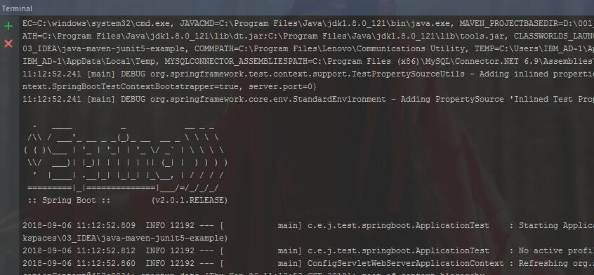

# java-maven-junit5-example

*Read this in other languages:[中文](README-cn.md).*


## Introduction
This repository contains some examples of JUnit 5

## Sample Code Component contains

- [X] [Junit 5 Basic Test](/src/test/java/com/example/junit5/test/basic) (done)
- [X] [Junit 5 Dynamic Test](/src/test/java/com/example/junit5/test/dynamic) (done)
- [X] [Junit 5 Assertions Test](/src/test/java/com/example/junit5/test/assertions) (done)
- [X] [Junit 5 Assumptions Test](/src/test/java/com/example/junit5/test/assumptions) (done)
- [X] [Junit 5 Nested Test](/src/test/java/com/example/junit5/test/nested) (done)
- [X] [Junit 5 Ignore/Disable parts of Test Case](/src/test/java/com/example/junit5/test/disable) (done)
- [ ] [Junit 5 Exception Control Test]() (doing...)
- [X] [Junit 5 Spring Boot Test Sample](/src/test/java/com/example/junit5/test/springboot) (done)
- [ ] [Jenkins + Maven integrate Junit 5 + TestNG to Test Automation]() (doing...)

## Test Steps
> NOTE: You could choose *clone* this repo., alternatively you could use the *Download Zip* button  to down code zip file to local.

1. [Clone the repo](#1-clone-the-repo)

   * [Import source code locally(*if you **Download Zip** file to local*)](#import-source-code-locallyif-you-dont-usedclonecommand)

      * [IntelliJ IDEA](#1-intellij-idea)

      * [Eclipse](#2-eclipse)

2. [Run the Junit 5 Test](#2-junit5-test)

3. [Test Result Report](#3-test-result-report)

### 1. Clone the repo

Clone the `java-maven-junit5-example` locally. In a terminal, run:

```
$ git clone https://github.com/bluetata/java-maven-junit5-example.git
```


#### Import source code locally(if you don't used`clone`command)

* #### 1. IntelliJ IDEA

Menu **File –> New –> Project from Exist Sources... –> Existing Maven Projects**

Browse and select **pom.xml** in your source code location

Then click **Next -> Next -> Next -> Finish** button to finish the importing.

* #### 2. Eclipse

Menu **File –> Import –> Maven –> Existing Maven Projects**,

Browse to your source code location,

Click **Finish** button to finish the importing.

### 2. Run the Junit 5 Test
In a terminal, run:

```
$ mvn test
```

> You can also run the test in IntelliJ IDEA: Right click in run test class and click run 'XxxXxxTest' with Coverage button.

### 3. Test Result Report

As the repo using *maven-surefire-report-plugin* plug, you can find the test report in **scr/target/surefire-reports** folder.

## Sample output

> Spring Running



> Test Result


> Coverage


> Test Result Report


## License
[Apache 2.0](LICENSE)


